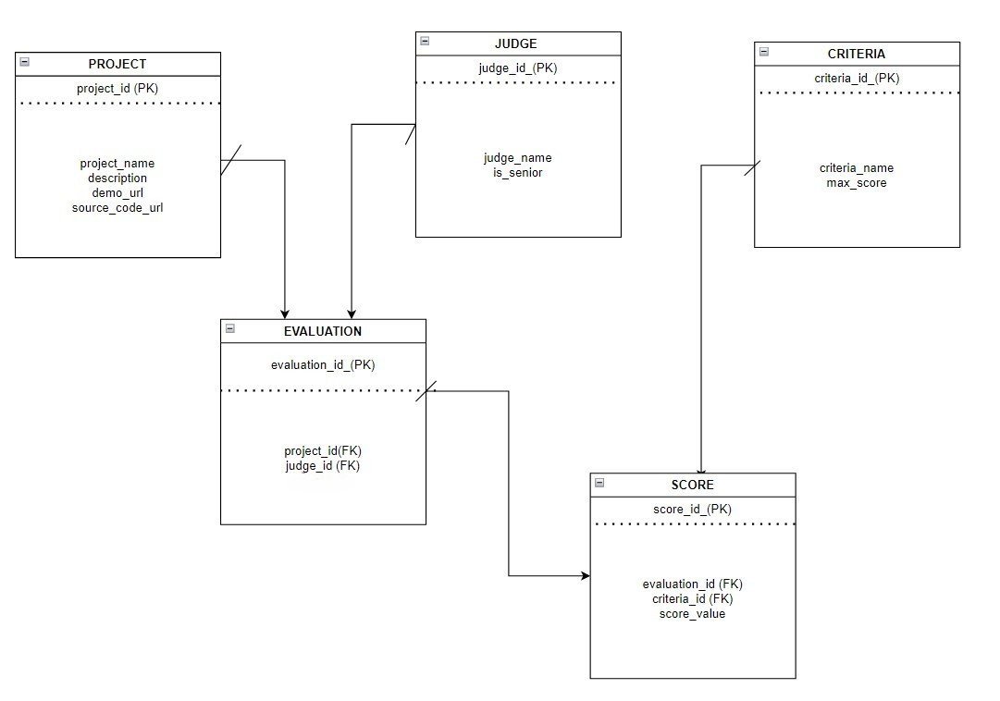

# Hackathon Judging Database

This is a SQL database design project for managing hackathon projects, judges, scoring criteria, evaluations, scores, and winner calculations.

## Project Description

The database stores hackathon projects, judges, scoring criteria, evaluations, and scores. Each project is evaluated by judges using different criteria. The final scores can be calculated with SQL queries to find the top projects.

## Main Tables

- `Project` - stores each hackathon project
- `Judge` - stores the judges
- `Criteria` - stores the scoring categories
- `Evaluation` - connects a judge to a project
- `Score` - stores the score for each evaluation and criterion

## Project Files

- [Database Schema](schema.sql)
- [Sample Data](insert-data.sql)
- [Queries](queries.sql)
- [Project Notes](project-notes.txt)
- [ER Diagram](er-diagram.jpg)

## ER Diagram

## What I Learned

This project helped me practice database design, primary keys, foreign keys, table relationships, SQL inserts, SQL queries, and calculating results from stored data.
